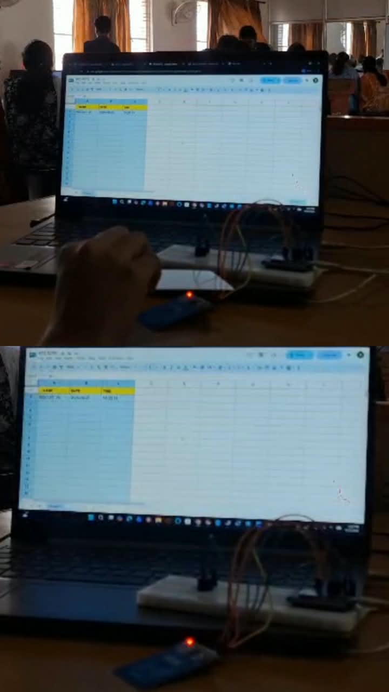

# **RETAIL360 – RFID Based Smart Shopping Trolley**

# **1.Project Overview**

# 

RETAIL360 is an RFID-based smart shopping trolley designed to reduce waiting time at supermarket billing counters.

The system automatically identifies products using RFID technology, processes the product information using ESP8266, and updates the trolley-wise billing details in Google Sheets.

# 

# **2.Problem Statement**

# 

In supermarkets, customers often wait in long billing queues. Manually scanning each product increases billing time and creates congestion at the billing counter.

RETAIL360 is developed to automate product identification and billing while the customer is shopping.

# 

# **3.Proposed Solution**

# 

Each product is assigned an RFID tag with a unique identification number.When a product is detected by the RFID reader, the RFID information is processed by the ESP8266. The product details are then sent through Wi-Fi and updated in Google Sheets.Each trolley is assigned a unique trolley number, allowing the system to maintain a separate digital bill for each trolley.

# 

# **4.Components Used**

# 

* ESP8266  
* RFID Reader  
* RFID Tags  
* Breadboard  
* Buzzer  
* Google Sheets

# **5.Block Diagram**

# 

RFID Tag

    ↓

RFID Reader

    ↓

ESP8266

    ↓

Wi-Fi / IoT

    ↓

Google Sheets

    ↓

Trolley-Wise Billing

# **6.Working Principle**

# 

*  The customer selects a smart trolley.  
*  The trolley is identified using its unique trolley number.  
*  The RFID reader detects the RFID tag attached to the product.  
* The ESP8266 receives and processes the RFID information.  
*  The corresponding product information is identified.  
*  The information is transmitted through Wi-Fi.  
*  Google Sheets updates the product details under the corresponding trolley number.  
* The total bill is automatically updated.  
* At the billing counter, the trolley number is used to retrieve the corresponding bill.  
*  The customer completes the payment.

# 

# 

# **7.Trolley-Wise Billing**

# 

Every smart trolley is assigned a unique trolley number.

The products scanned through a particular trolley are automatically associated with that trolley number. This allows the system to maintain separate digital billing records for multiple trolleys.

# 

# **8.Google Sheets Integration**

# 

Google Sheets is used as the digital billing database.

The system maintains:

* Trolley Number  
* RFID ID  
* Product Name  
* Product Price  
* Total Amount

The billing information is updated automatically whenever a product is detected.

# **9.Key Features**

# 

* RFID-based product identification  
* Trolley-wise billing  
* Automatic product entry  
* Automatic total calculation  
* Real-time billing updates  
* Google Sheets integration  
* ESP8266 Wi-Fi connectivity  
* Buzzer indication  
* Reduced manual scanning

# **10.Advantages**

# 

* Reduces customer waiting time  
* Reduces manual billing work  
* Provides real-time bill updates  
* Maintains separate trolley-wise billing records  
* Makes the checkout process faster  
* Provides digital billing records

# 

# **11.Demerits**

# 

* Requires Wi-Fi connectivity for online data updates  
* RFID tags need proper product mapping  
* Product removal detection requires additional sensing  
* Large-scale implementation requires a more advanced database system

# 

# 

# **12.Future Scope**

# 

* Mobile application integration  
* LCD/OLED display on the trolley  
* Digital payment integration  
* Automatic product removal detection  
* Inventory and stock management  
* Customer purchase history

# 

# 

# **13.Technologies Used**

* RFID Technology  
* ESP8266  
* Wi-Fi / IoT  
* Google Sheets  
* Arduino IDE

# 

# 

# **14.Project Outcome**

# 

RETAIL360 demonstrates an IoT-based smart shopping trolley that automatically identifies products and maintains trolley-wise digital billing information.

The integration of RFID, ESP8266, Wi-Fi, and Google Sheets provides an automated approach to supermarket billing and helps reduce manual scanning and checkout time.

# 

# 
